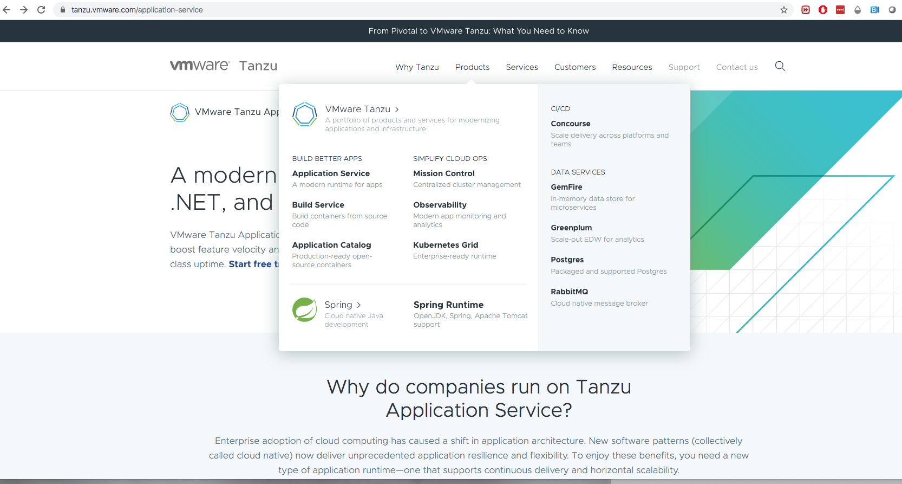
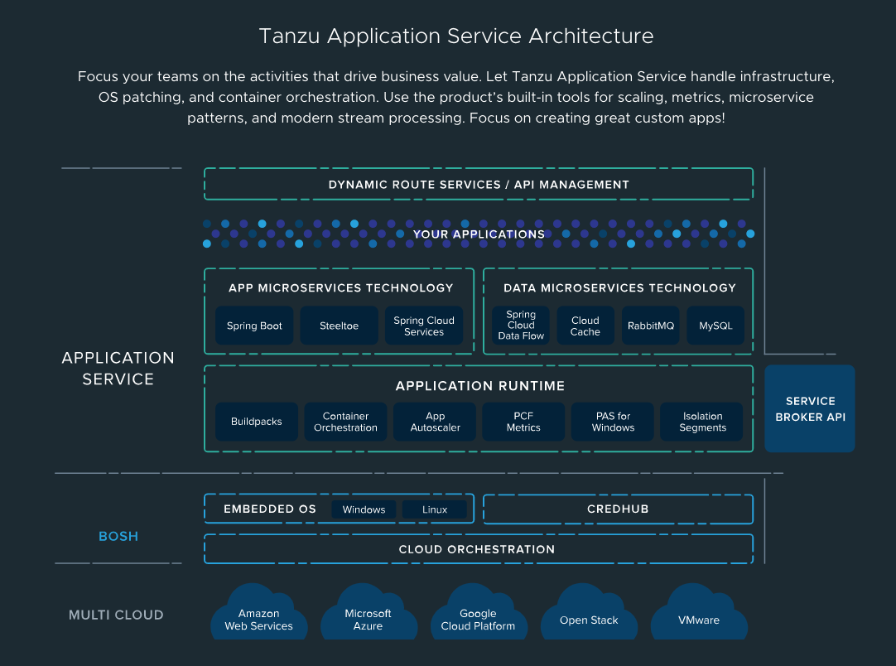
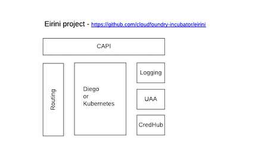
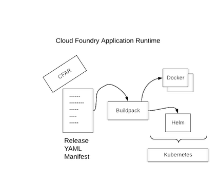

# VMWare Tanzu and CloudFoundry Kubernetes

## Table of Contents

   * [Introduction](#introduction)
      * [VMware Tanzu](#vmware-tanzu)
      * [Cloudfoundry](#cloudfoundry)
         * [Kubernetes projects](#kubernetes-projects)
   * [DevExp on k8s](#devexp-on-k8s)
   * [Interesting references](#interesting-references)
   * [For the Developers](#for-the-developers)

## Introduction

This project has been created to collect information about the Kubernetes offering of [VMWare Tanzu](https://github.com/vmware-tanzu) and [Cloudfoundry](https://www.cloudfoundry.org/).
 
### VMware Tanzu 

VMware Tanzu is a new brand from VMware that encompasses many application-platform products, and now that Pivotal is part of VMware 
the Pivotal Application Service distribution of CF is moving into the collection of products under that Tanzu brand.

So stricto sensu, Tanzu (ex Pivotal) is a `portfolio of products and services for modernizing applications and infrastructure` on Kubernetes.
According to the web site, the platform is based on the following open source projects: https://tanzu.vmware.com/open-source.

The Tanzu team have been working on a version running on K8s and have been basing that primarily on the [cf-for-k8s integration project](https://github.com/cloudfoundry/cf-for-k8s).

**REMARK**: `kubecf` and `cf-for-k8s` are different projects with different approaches to accomplish similar things. The former is essentially all the CF components translated into K8S helm charts and images (soon to be replaced by a CRD operator).
The latter repackages `CF` at source.

Here is the list of the features as proposed - March 2020.

1. BUILD BETTER APPS

  - [Application Service](https://tanzu.vmware.com/application-service): A modern runtime for apps. Dependency management, load balancing, container orchestration, logging, and auditing are done for you.
  - [Build Service](https://tanzu.vmware.com/build-service): Build containers from source code and automates container creation, management, and governance at enterprise scale
  - [Application Catalog](https://tanzu.vmware.com/application-catalog): Catalog of production-ready open-source software from the Bitnami collection.

2. SIMPLIFY CLOUD OPS

  - [Mission Control](https://tanzu.vmware.com/mission-control): Centralized cluster management
  - [Observability](https://tanzu.vmware.com/observability): Modern app monitoring and analytics
  - [Kubernetes Grid](https://tanzu.vmware.com/kubernetes-grid): Streamline operations across multi-cloud infrastructure

3. FRAMEWORKS
  - Spring : Cloud native Java development
  - Spring Runtime:  OpenJDK, Spring, Apache Tomcat support

4. CI/CD

  - [Concourse](https://tanzu.vmware.com/concourse): Scale delivery across platforms and teams. Simplify CI/CD workflows. Automate your path to production with declarative, reusable pipelines.

5. DATA SERVICES

  - [GemFire](https://tanzu.vmware.com/gemfire): In-memory data store for microservices. High-performance application cache, a database, and much more
  - [Greenplum](https://tanzu.vmware.com/greenplum): Scale-out EDW for analytics
  - [Postgres](https://tanzu.vmware.com/postgres): Packaged and supported Postgres 10,11 & 12. 24x7 support. Includes high availability, backups, and analytics
  - [RabbitMQ](https://tanzu.vmware.com/rabbitmq): Cloud native message broker
 
### Cloudfoundry

Great introduction : http://basics-workshop.cloudfoundry.org/slides/#/20

The Cloudfoundry platform, which is in fact what `VMWare Tanzu` is using under the hood, is progressively migrating to `kubernetes`. To support such a migration, the core components of the platform have been containerized and
packaged as helm charts within the project `kubecf`. 

**FYI**: Some of the most important components of the CloudFoundry platform are listed hereafter: 

- [Capi](https://github.com/cloudfoundry/cloud_controller_ng): API controller used by the `CLI` to interact with the Cloud platform
- [Uua](https://github.com/cloudfoundry/uaa): User Account and Authorisation server - OpenID
- [Bosh](https://github.com/cloudfoundry/bosh): An open source tool for release engineering, deployment, lifecycle management, and monitoring of distributed systems.
- [Diego](https://github.com/cloudfoundry/diego-design-notes): Diego schedules and runs Tasks and Long-Running Processes. it is able to take a `Docker image` and create a container
- [Bits-service](https://github.com/cloudfoundry-incubator/bits-service): OCI Registry
- [Stratos](https://github.com/cloudfoundry/stratos): Developer console

#### Kubernetes projects

Different upstream projects have been designed to manage the Cloud Foundry distribution top of Kubernetes [kubecf](https://kubecf.suse.dev/docs/). The most important of such projects are : `Eirini` and `Quarks`

1. [Eirini](https://github.com/cloudfoundry-incubator/eirini)

In a nutshell Eirini is a Kubernetes backend for Cloud Foundry, made in the effort to decouple Cloud Foundry from Diego, the only current option of a scheduler. It deploys CF apps to a kube backend, using OCI images and Kube deployments.
Eirini provides an `Orchestrator Provider Interface (OPI)` layer, that abstracts away orchestration from Cloud Foundry's control plane. This means Eirini is not solely a Kube backend at all, 
but that it is a generic backend for any scheduler! This means it could schedule to `Diego`, `Kube`, `Swarm` and other orchestration providers, as long as there is `an implementation` of the `OPI layer` for the target platform.

  **NOTE**: When Eirini deploys an application on kubernetes (= `cf push`), then it will create by default a `statefulset` kubernetes like a `Service` or `Ingress` resources (TO BE CHECKED). If the team/project
  wants to extend the resources created, then it is needed to create a K8s Webhook. This is the reason why the [project](https://www.cloudfoundry.org/blog/introducing-eirinix-how-to-build-eirini-extensions/) `EiriniX` has been created
  to make the Eirini ecosystem `pluggable`.

2. [Quarks](https://kubecf.suse.dev/docs/concepts/quarks/)

The is like `Eirini` an incubating project and effort that packages `Cloud Foundry Application Runtime` as `containers` instead of `virtual machines` enabling easy deployment to Kubernetes.
The resulting containerized CFAR provides an identical developer experience to that of BOSH-managed Cloud Foundry installations, requires less infrastructure capacity and delivers an operational experience that is familiar to Kubernetes operators.

It is delivered as a Kubernetes Operator called [`cf-operator`](https://github.com/cloudfoundry-incubator/cf-operator) which enables the deployment of BOSH Releases, especially Cloud Foundry, to Kubernetes.

- [CFAR](https://www.cloudfoundry.org/container-runtime/): Cloud Foundry Container Runtime (CFCR) 

**NOTE**: KubeCF uses the [Cloud Foundry Operator](https://github.com/cloudfoundry-incubator/cf-operator/) to deploy and track CF Deployments, consuming directly also `BOSH Releases`, among Kubernetes Native components.

Cloud Foundry offers then 2 solutions to manage either the Kubernetes clusters top of a public cloud provider (vSphere, GCP, ...) or the containerized applications:
- `CF Container Runtime` which is built using `Kubernetes` and `CF BOSH`. They will be used when you need more flexibility and developer-built containers for apps, or are using pre-packaged apps delivered in a container.
- `CF Application Runtime`. For cloud-native, 12-factor applications, CF Application Runtime will likely be the best deployment method.

List of Cloud Foundry [projects](https://www.cloudfoundry.org/projects/), github repo, points of contact, channels to chat, ...

**Remarks**: 

The project `kubo` created by Google and CloudFoundry and called now `CF Container Runtime` is positioned within the [Cloud Foundry doc](https://www.youtube.com/watch?v=CwAmh8MdWCg) as a 
project able to manage Kubernetes clusters, scaling them using `Bosh Director` top of vSphere, GCP, ... It then uses `agent` deployed within the VMs where the
Kubernetes Master/Node are deployed and will schedule jobs in order to create new VMs, perform rolling upgrade without zero downtime.

## DevExp on k8s

**WARNING**: The following section which has been created from this [video](https://www.youtube.com/watch?v=CwAmh8MdWCg) is certainly not correct at all anymore as currently `fissile` is not used at all but instead `buildpack` and 
no `helm chart` is created when we push a spring boot application on k8s. It must be reviewed and updated !

A `CF Application runtime` or `CFAR` is then deployed on Kubernetes using a Helm chart according to the the information defined within an [Application yaml manifest](https://docs.cloudfoundry.org/devguide/deploy-apps/manifest-attributes.html) 
which is then processed by [`fissile or Buildpack`](https://github.com/cloudfoundry-incubator/fissile) to populate the container image. 

**NOTE**: The new approach should be based on [`CNCF - Buildpack`](https://docs.cloudfoundry.org/buildpacks/understand-buildpacks.html). Is it then used by `fissile` or another tool internally ?

## Interesting references

- Install locally cfdev and deploy an application: https://tanzu.vmware.com/tutorials/getting-started/local/install-pivotal-dev
- Deploy cloudfoundry on a local k8s: https://medium.com/@jmpinto/deploying-cloudfoundry-on-a-local-kubernetes-9103a57bf713
- kubecf doc: https://kubecf.suse.dev/docs/getting-started/kubernetes-deploy/
- cf-operator: https://github.com/cloudfoundry-incubator/cf-operator

## For the Developers

To play with CloudFoundry on K8s, move to the [developer page](DEVELOPER.md)
