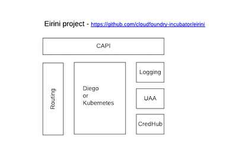
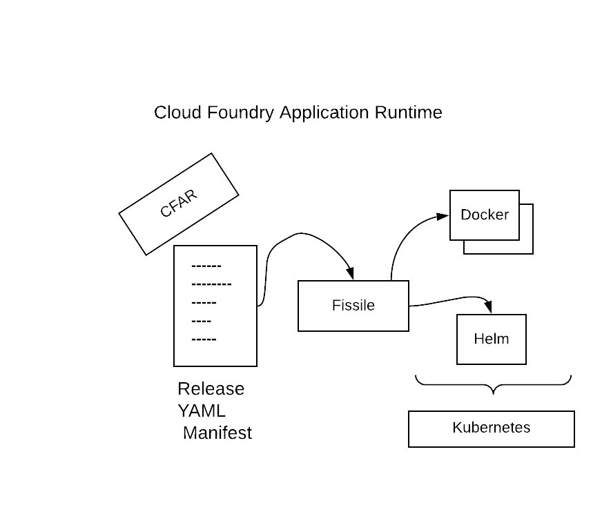

# VMWare Tanzu and CloudFoundry Kubernetes

## Table of Contents

   * [Introduction](#introduction)
      * [VMware Tanzu](#vmware-tanzu)
      * [Cloudfoundry](#cloudfoundry)
   * [DevExp on k8s](#devexp-on-k8s)
   * [Cloud Foundry Kubernetes](#cloud-foundry-kubernetes)
      * [Deploy using Kubernetes Kind](#deploy-using-kubernetes-kind)
      * [Additional features needed for kind](#additional-features-needed-for-kind)
      * [Deploy on a Kubernetes created using kubeadm, kubelet](#deploy-on-a-kubernetes-created-using-kubeadm-kubelet)
      * [Play with Eirini](#play-with-eirini)
   * [Interesting references](#interesting-references)


## Introduction

This project has been created to collect information about the Kubernetes offering of [VMWare Tanzu](https://github.com/vmware-tanzu) and [Cloudfoundry](https://www.cloudfoundry.org/).
 
### VMware Tanzu 

A portfolio of products and services for modernizing applications and infrastructure

1.BUILD BETTER APPS

- Application Service: A modern runtime for apps
- Build Service: Build containers from source code
- Application Catalog: Production-ready open-source containers

2. SIMPLIFY CLOUD OPS
- Mission Control: Centralized cluster management
- Observability: Modern app monitoring and analytics
- Kubernetes Grid: Enterprise-ready runtime

Spring : Cloud native Java development
Spring Runtime:  OpenJDK, Spring, Apache Tomcat support

3. CI/CD
- Concourse: Scale delivery across platforms and teams

4. DATA SERVICES
- GemFire: In-memory data store for microservices
- Greenplum: Scale-out EDW for analytics
- Postgres: Packaged and supported Postgres
- RabbitMQ: Cloud native message broker
 
### Cloudfoundry

The Cloudfoundry platform is progressively migrating to kubernetes. The core components of the platform are listed hereafter: 

- [uua](https://github.com/cloudfoundry/uaa): User Account and Authorisation server - OpenID
- [Diego](https://github.com/cloudfoundry/diego-design-notes): Diego schedules and runs Tasks and Long-Running Processes. it is able to take a `Docker image` and create a container
- [Bosh](https://github.com/cloudfoundry/bosh): an open source tool for release engineering, deployment, lifecycle management, and monitoring of distributed systems.
- [Stratos](https://github.com/cloudfoundry/stratos): Developer console
- [Capi](https://github.com/cloudfoundry/cloud_controller_ng): API controller

Three upstream projects have been designed to develop the Cloud Foundry distribution for Kubernetes [kubecf](https://kubecf.suse.dev/docs/).

- [Eirini](https://github.com/cloudfoundry-incubator/eirini): In a nutshell Eirini is a Kubernetes backend for Cloud Foundry, made in the effort to decouple Cloud Foundry from Diego, the only current option of a scheduler. It deploys CF apps to a kube backend, using OCI images and Kube deployments.



- [Quarks](https://kubecf.suse.dev/docs/concepts/quarks/): Incubating effort that packages `Cloud Foundry Application Runtime` as `containers` instead of `virtual machines`
- [CFAR](https://www.cloudfoundry.org/container-runtime/): Cloud Foundry Container Runtime (CFCR) 

**NOTE**: KubeCF uses the [Cloud Foundry Operator](https://github.com/cloudfoundry-incubator/cf-operator/) to deploy and track CF Deployments, consuming directly also `BOSH Releases`, among Kubernetes Native components.

Cloud Foundry offers then 2 solutions to manage either the Kubernetes clusters top of a public cloud provider (vSphere, GCP, ...) or the containerized applications:
- `CF Container Runtime` which is built using `Kubernetes` and `CF BOSH`. They will be used when you need more flexibility and developer-built containers for apps, or are using pre-packaged apps delivered in a container.
- `CF Application Runtime`. For cloud-native, 12-factor applications, CF Application Runtime will likely be the best deployment method.

List of Cloud Foundry [projects](https://www.cloudfoundry.org/projects/), github repo, points of contact, channels to chat, ...

**Remarks**: 

The project `kubo` created by Google and CloudFoundry and called now `CF Container Runtime` is positioned within the [Cloud Foundry doc](https://www.youtube.com/watch?v=CwAmh8MdWCg) as a 
project able to manage Kubernetes clusters, scaling them using `Bosh Director` top of vSphere, GCP, ... It then uses `agent` deployed within the VMs where the
Kubernetes Master/Node are deployed and will schedule jobs in order to create new VMs, perform rolling upgrade without zero downtime.

## DevExp on k8s

A `CF Application runtime` or `CFAR` is then deployed on Kubernetes using a Helm chart according to the the information defined within an [Application yaml manifest](https://docs.cloudfoundry.org/devguide/deploy-apps/manifest-attributes.html) 
which is then processed by [`fissile or Buildpack`](https://github.com/cloudfoundry-incubator/fissile) to populate the container image. 



**NOTE**: The new approach should be based on [`CNCF - Buildpack`](https://docs.cloudfoundry.org/buildpacks/understand-buildpacks.html). Is it then used by `fissile` or another tool internally ?

## Cloud Foundry Kubernetes

To play with the new Cloud Foundry Kubernetes distribution, it is required to have :
- A Kubernetes cluster (>= 1.14)
- The Helm tool (>= 1.13)
- The kubectl client installed
- A docker daemon

Next, you will install 2 helm charts in order to deploy:
- cf-operator: https://cloudfoundry-incubator.github.io/quarks-helm/
- kubecf: https://github.com/cloudfoundry-incubator/kubecf/tree/master/deploy/helm/kubecf

**NOTES**

The `cf-operator` is the underlying generic tool to deploy a (modified) BOSH deployment like Kubecf for use.
It has to be installed in the same Kubernetes cluster that Kubecf will be deployed to.

In this default deployment, kubecf is launched without Ingress, and it uses the Diego scheduler.

### Deploy using Kubernetes Kind

- Install first [`kind`](https://kind.sigs.k8s.io/docs/user/quick-start/#installation)
```bash
cd ~/temp
alias sudo='sudo env PATH=$PATH'
curl -Lo ./kind https://github.com/kubernetes-sigs/kind/releases/download/v0.7.0/kind-$(uname)-amd64
chmod +x ./kind
sudo mv kind /usr/local/bin
```
- Create a [kind config file]() mapping and exposing additional ports and configuring ingress
```bash
cat << _EOF_  > cfg.yml
kind: Cluster
apiVersion: kind.x-k8s.io/v1alpha4
nodes:
- role: control-plane
  kubeadmConfigPatches:
  - |
    kind: InitConfiguration
    nodeRegistration:
      kubeletExtraArgs:
        node-labels: "ingress-ready=true"
        authorization-mode: "AlwaysAllow"
  extraPortMappings:
  - containerPort: 80
    hostPort: 80
    protocol: TCP
  - containerPort: 443
    hostPort: 443
    protocol: TCP
_EOF_
```
- Create a kubernetes cluster
```bash
sudo kind create cluster --name kubecf --config=cfg.yml
sudo kind get kubeconfig --name kubecf > .kubeconfig
```

- Create an alias to use `kc` instead of `kubectl` and export the `KUBECONFIG` env var
```bash
alias kc=kubectl
export KUBECONFIG=.kubeconfig
```
- Create a namespace for the cf-operator and install it
```bash
kc create namespace cf-operator
helm repo add quarks https://cloudfoundry-incubator.github.io/quarks-helm/
helm search repo quarks
helm install cf-operator quarks/cf-operator --namespace cf-operator --set "global.operator.watchNamespace=kubecf"
```
- Create the following `values.yaml` file with the `Node IP` address that we could use within the vm
```bash
node_ip=$(kubectl get node kubecf-control-plane \
  --output jsonpath='{ .status.addresses[?(@.type == "InternalIP")].address }')
cat << _EOF_  > values.yaml
system_domain: ${node_ip}.nip.io
features:
  eirini:
    enabled: true
  ingress:
    enabled: false
    tls:
      crt: ~
      key: ~
    annotations: {}
    labels: {}
services:
  router:
    externalIPs:
    - ${node_ip}
kube:
  service_cluster_ip_range: 0.0.0.0/0
  pod_cluster_ip_range: 0.0.0.0/0
_EOF_
```

- Install the `KubeCF` helm chart
```bash
helm install kubecf \
   --namespace kubecf \
   --values values.yaml https://github.com/cloudfoundry-incubator/kubecf/releases/download/v1.0.0/kubecf-v1.0.0.tgz
```

- Watch the pods
```bash
kubectl -n kubecf get pods -w
```

### Additional features needed for kind

- Create a Cluster Admin Group for the group `system:bootstrappers` used to access the console/dashboard using a Token created as a secret with token-id, token-secret, auth-extra-groups: system:bootstrappers:worker
```bash
export NODE_IP=95.217.134.196
export TOKEN_PUBLIC=<CHANGE.ME>
export TOKEN_SECRET=<CHANGE.ME>

cat << _EOF_  > security-dashboard.yml
---
kind: ClusterRoleBinding
apiVersion: rbac.authorization.k8s.io/v1
metadata:
  name: cluster-admin-for-bootstrappers
subjects:
- kind: Group
  name: system:bootstrappers
  apiGroup: rbac.authorization.k8s.io
roleRef:
  kind: ClusterRole
  name: cluster-admin
  apiGroup: rbac.authorization.k8s.io

---
apiVersion: v1
kind: Secret
metadata:
  name: bootstrap-token-${TOKEN_PUBLIC}
  namespace: kube-system

type: bootstrap.kubernetes.io/token
stringData:
  # Human readable description. Optional.
  description: snowdrop-admin-user

  # Token ID and secret. Required.
  token-id: ${TOKEN_PUBLIC}
  token-secret: ${TOKEN_SECRET}

  # Allowed usages.
  usage-bootstrap-authentication: "true"
  usage-bootstrap-signing: "true"
  auth-extra-groups: system:bootstrappers:worker
_EOF_

kc apply -f security-dashboard.yml
```

- Install the k8s dashboard
```bash
kc apply -f https://raw.githubusercontent.com/kubernetes/dashboard/v2.0.0-beta8/aio/deploy/recommended.yaml
```

- Deploy [Ingress](https://kind.sigs.k8s.io/docs/user/ingress/) controller
```bash
kc apply -f https://raw.githubusercontent.com/kubernetes/ingress-nginx/nginx-0.30.0/deploy/static/mandatory.yaml
kc apply -f https://raw.githubusercontent.com/kubernetes/ingress-nginx/nginx-0.30.0/deploy/static/provider/baremetal/service-nodeport.yaml
kc patch deployments -n ingress-nginx nginx-ingress-controller -p '{"spec":{"template":{"spec":{"containers":[{"name":"nginx-ingress-controller","ports":[{"containerPort":80,"hostPort":80},{"containerPort":443,"hostPort":443}]}],"nodeSelector":{"ingress-ready":"true"},"tolerations":[{"key":"node-role.kubernetes.io/master","operator":"Equal","effect":"NoSchedule"}]}}}}'
```
- Create an `ingress resource` to access the dashboard from any machine
```bash
cat << _EOF_  > ingress-dashboard.yml
apiVersion: extensions/v1beta1
kind: Ingress
metadata:
  annotations:
    nginx.ingress.kubernetes.io/backend-protocol: "HTTPS"
    kubernetes.io/ingress.class: nginx
  labels:
    app: kubernetes-dashboard
  name: kubernetes-dashboard
  namespace: kubernetes-dashboard
spec:
  rules:
  - host: k8s-console.${NODE_IP}.nip.io
    http:
      paths:
      - backend:
          serviceName: kubernetes-dashboard
          servicePort: 443
        path: /
_EOF_

kc apply -f ingress-dashboard.yml
```

- To destroy/clean the cluster
```bash
sudo kind delete cluster --name kubecf
```

### Deploy on a Kubernetes created using kubeadm, kubelet

**NOTE**: The scenario reported here will fail due to a problem with the Certificate needed by the UAA application. [Ticket](https://github.com/cloudfoundry-incubator/kubecf/issues/483) has been created and should be fiexed with
release [1.2.0](https://github.com/cloudfoundry-incubator/kubecf/issues?q=is%3Aopen+is%3Aissue+milestone%3A1.2.0)

- SSH to the vm where k8s >= 1.15 is deployed
```bash
ssh -i ~/.ssh/id_rsa_snowdrop_hetzner_k03-k116 snowdrop@95.217.134.196 -p 47286
```
- Install Helm tool within the VM

```bash
mkdir temp && cd temp
sudo yum install wget
wget https://get.helm.sh/helm-v3.1.1-linux-amd64.tar.gz
tar -vxf helm-v3.1.1-linux-amd64.tar.gz
sudo mv linux-amd64/helm /usr/local/bin/helm
alias kc=kubectl
```

- Create a namespace for the cf-operator and install it
```bash
kc create ns cf-operator

helm repo add quarks https://cloudfoundry-incubator.github.io/quarks-helm/
helm search repo quarks
helm install cf-operator quarks/cf-operator --namespace cf-operator --set "global.operator.watchNamespace=kubecf"
```

- Create the following `values.yaml` file with the VM Ethernet IP address that we could use from our laptop
```bash
NODE_NAME=k03-k116
node_ip=$(kubectl get node ${NODE_NAME} \
  --output jsonpath='{ .status.addresses[?(@.type == "InternalIP")].address }')
cat << _EOF_  > values.yaml
system_domain: ${node_ip}.nip.io
services:
  router:
    externalIPs:
    - ${node_ip}
kube:
  service_cluster_ip_range: 0.0.0.0/0
  pod_cluster_ip_range: 0.0.0.0/0
_EOF_
```

- Install the `KubeCF` helm chart
```bash
helm install kubecf \
   --namespace kubecf \
   --values values.yaml https://github.com/cloudfoundry-incubator/kubecf/releases/download/v1.0.0/kubecf-v1.0.0.tgz
```

- Watch the pods
```bash
kubectl -n kubecf get pods -w
```

### Play with Eirini

- Maven and JDK should be installed on the VM
```bash
sudo yum install maven
```

- Install first the `cf` client as documented [here](https://github.com/cloudfoundry/cli#downloads)
```bash
cd temp
curl -L "https://packages.cloudfoundry.org/stable?release=linux64-binary&source=github" | tar -zx
sudo mv cf /usr/local/bin
```

- If you want to use the Developer console - stratos, install it using the following helm chart
```bash
kc create ns consolehelm status my-console
helm repo add stratos https://cloudfoundry.github.io/stratos
helm install my-console stratos/console --namespace console
```
**NOTE**: TODO: Add ingress and create a resource to access the console !

- Next, access the CF API using the node ip address as registered
```bash
cf api --skip-ssl-validation api.172.17.0.2.nip.io
Setting api endpoint to api.172.17.0.2.nip.io...
OK

api endpoint:   https://api.172.17.0.2.nip.io
api version:    2.146.0
Not logged in. Use 'cf login' or 'cf login --sso' to log in.
```

- We fetch the random generated credentials for the default `admin user` 
```bash
export admin_pass=$(kubectl get secret \
          --namespace kubecf kubecf.var-cf-admin-password \
          -o jsonpath='{.data.password}' \
          | base64 --decode)
```

- We authenticate using those credentials
```bash
cf auth admin "${admin_pass}"
API endpoint: https://api.172.17.0.2.nip.io
Authenticating...
OK

Use 'cf target' to view or set your target org and space.
```
- Let’s create a `demo` organization, a `space` and a `development user`
```bash
cf create-org redhat.com
cf create-space demo -o redhat.com
cf create-user developer password
cf set-space-role developer redhat.com demo SpaceManager
```
- Switch to the developer user
```bash
cf login -u developer -p password
API endpoint: https://api.172.17.0.2.nip.io
Authenticating...
OK
Targeted org redhat.com
Targeted space demo

API endpoint:   https://api.172.17.0.2.nip.io (API version: 2.146.0)
User:           developer
Org:            redhat.com
Space:          demo
```
- Install a Spring Boot application and build it
```bash
git clone https://github.com/cloudfoundry-samples/spring-music
cd spring-music/
./gradlew assemble
```
- Next push it on the k8s cluster
```bash
cf push --hostname spring-music
Deprecation warning: Use of the '--hostname' command-line flag option is deprecated in favor of the 'routes' property in the manifest. Please see https://docs.cloudfoundry.org/devguide/deploy-apps/manifest-attributes.html#routes for usage information. The '--hostname' command-line flag option will be removed in the future.

Pushing from manifest to org redhat.com / space demo as developer...
Using manifest file /home/snowdrop/temp/spring-music/manifest.yml
Getting app info...
Creating app with these attributes...
+ name:       spring-music
  path:       /home/snowdrop/temp/spring-music/build/libs/spring-music-1.0.jar
+ memory:     1G
  env:
+   JBP_CONFIG_SPRING_AUTO_RECONFIGURATION
  routes:
+   spring-music.172.17.0.2.nip.io

Creating app spring-music...
You are not authorized to perform the requested action
FAILED
```
## Interesting references

- Install locally cfdev and deploy an application: https://tanzu.vmware.com/tutorials/getting-started/local/install-pivotal-dev
- Deploy cloudfoundry on a local k8s: https://medium.com/@jmpinto/deploying-cloudfoundry-on-a-local-kubernetes-9103a57bf713
- kubecf doc: https://kubecf.suse.dev/docs/getting-started/kubernetes-deploy/
- cf-operator: https://github.com/cloudfoundry-incubator/cf-operator
